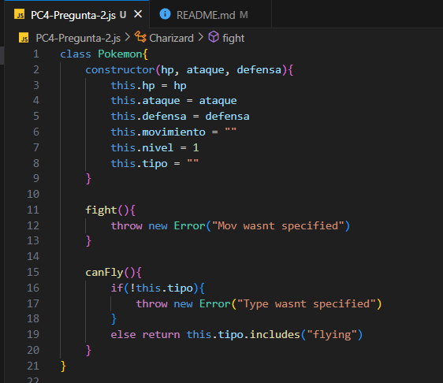
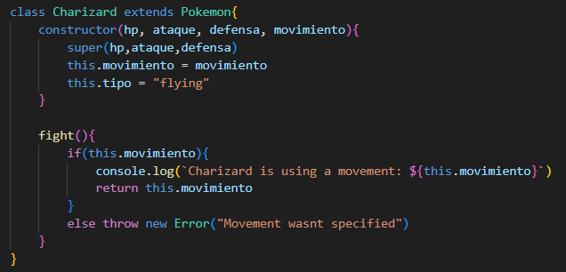
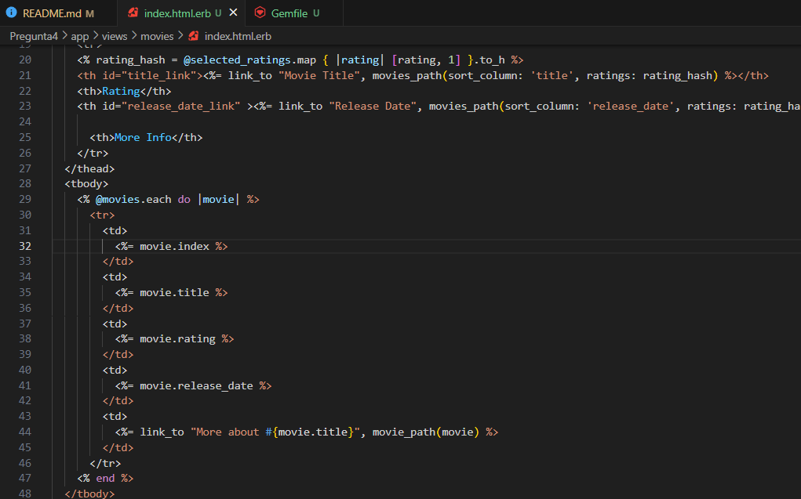
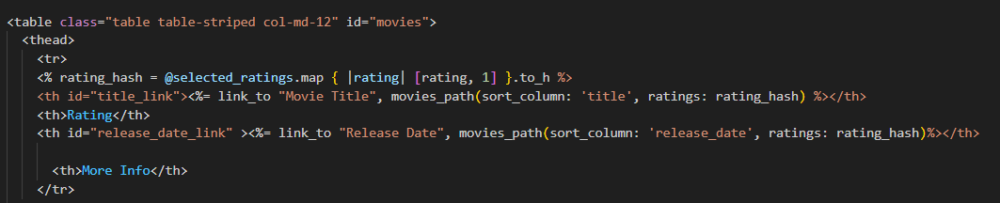
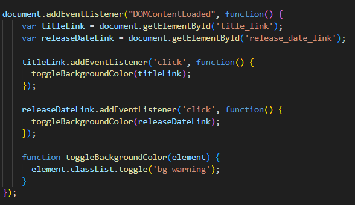
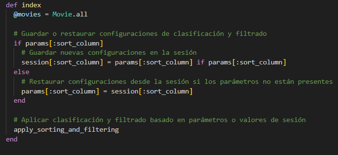
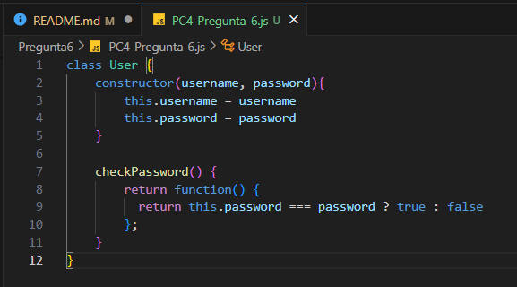
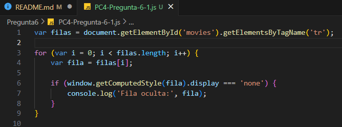

# PracticaCalificada4

***

## Pregunta 2

- Clase Pokemon

- Clase Charizard

## Pregunta 4

1. Modificamos la vista index para incluir el número de fila de cada fila en la tabla de películas.

- Agregamos una fila con el index es decir el número de fila

- Asi se visualiza

2. Modificamos la vista index para que cambie temporalmente su color cada vez que se hace click

- Primero le añadimos un id a la etiqueta html para asi poder reconocerla en el archivo js

- Ahora añadimos la lógica que va a realizar el cambio de color usando las clases de bootstrap

3. Modificamos la acción index del controlador para que devuelva las películas ordenadas alfabéticamente por título 

- Utilizamos el método sort para ordenar las películas por el título

## Pregunta 5

- Extienda el código del controlador del código siguiente dado con los métodos edit y update para las críticas.

## Pregunta 6

- Constructor para User que utiliza una clausura para verificar la contraseña proporcionada

- En el código utilizado en la sección de eventos y funciones callback, supongamos que no puedes modificar el código del servidor para añadir la clase CSS adult a las filas de la tabla movies. ¿Cómo identificaría las filas que están ocultas utilizando sólo código JavaScript del lado cliente?

Primero obtenemos las filas con su id y con su etiqueta que en este caso es tr, luego iteramos sobre estas para verificar si están ocultas o no utilizando la clase de display none en css.
